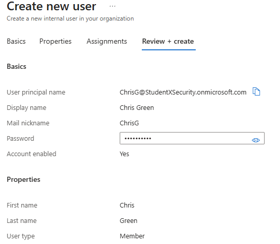
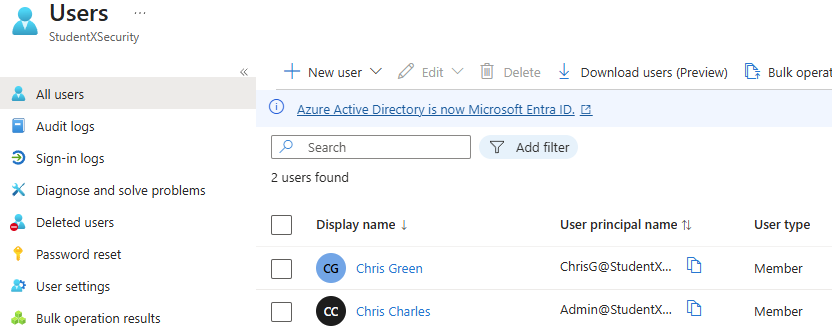
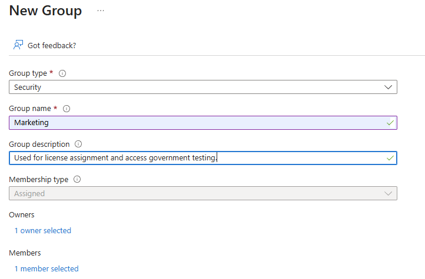
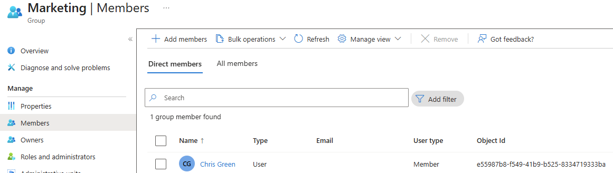
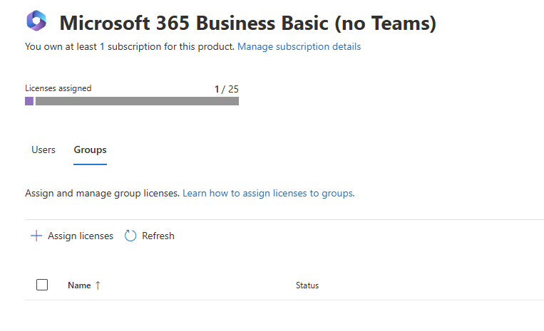
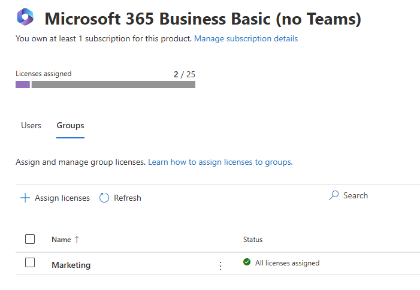
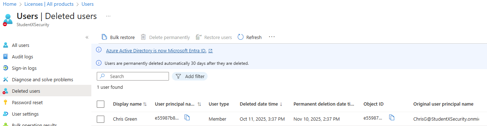
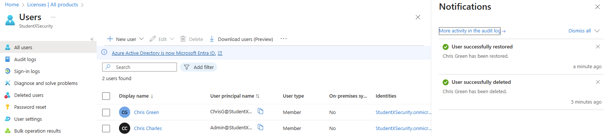
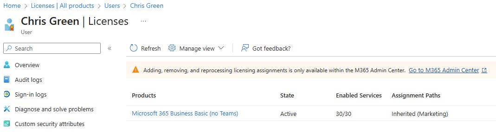

**Lab Title:** Microsoft Entra ID – Assign Licenses to Users  
**Author:** Chris (Xavier) Charles — StudentXSec Labs  
**Date Executed:** 2025-10-11  
**Lab Environment:** StudentXSecurity.onmicrosoft.com (Business Tenant)  
**IAM Role Used:** Global Administrator (Admin@StudentXSecurity.onmicrosoft.com)  
**Framework Alignment:** NIST 800-53 AC-2 (Account Management), AC-3 (Access Enforcement)  
**Tools & Platforms:** Microsoft Entra ID, Microsoft 365 Admin Center  
**Lab Type:** IAM / Access Governance  
**Version:** v1.0  
---

## 📑 Table of Contents
- [🎯 Objective](#-objective)
- [🧰 Tools & Environment](#-tools--environment)
- [🧠 Key Skills Practiced](#-key-skills-practiced)
- [🪜 Steps Performed](#-steps-performed)
- [📑 Results Summary](#-results-summary)
- [💡 Key Takeaways](#-key-takeaways)
- [🧩 Evidence Files](#-evidence-files)
- [📚 Framework Reference](#-framework-reference)
- [🧾 Change History](#-change-history)

---

## 🎯 Objective
Perform identity lifecycle operations in Microsoft Entra ID:
- Create and manage users and security groups.
- Assign Microsoft 365 licenses through group-based licensing.
- Demonstrate access governance, compliance alignment, and account recovery.

---

## 🧰 Tools & Environment
- **Microsoft Entra ID** (Azure AD)
- **Microsoft 365 Admin Center**
- **Role:** Global Administrator
- **Tenant:** StudentXSecurity.onmicrosoft.com
- **License Type:** Microsoft 365 Business Basic (Trial)
- *Note: Group-based license assignment required activation of the Microsoft Entra ID Premium P1 trial (30-day).*

---

## 🧠 Key Skills Practiced
- Identity provisioning and deprovisioning  
- Role-based access control (RBAC)  
- Group-based license management  
- User lifecycle management (Joiner–Leaver process)  
- Documentation and audit-style evidence collection  

---

## 🪜 Steps Performed

### Step 1 – Create User: *Chris Green*
1. Navigate to **Microsoft Entra ID → Users → All Users → + New User.**
2. Enter the following details:  
   - **Username:** `ChrisG`  
   - **Name:** `Chris Green`  
   - **Password:** Temporary password generated automatically.
3. Click **Create** and verify that the user appears in the “All Users” list.

**Before Creation:**  

**After Creation:**  

---

### Step 2 – Create Security Group: *Marketing*
1. Go to **Microsoft Entra ID → Groups → + New Group.**
2. Fill in the following:
   - **Group type:** Security  
   - **Group name:** Marketing  
   - **Membership type:** Assigned  
   - **Owner:** Admin@StudentXSecurity.onmicrosoft.com  
   - **Member:** Chris Green  
3. Click **Create** and verify that the group appears in “All Groups.”

**Group Creation Form:**  

**Group Membership View:**  

---

### Step 3 – Assign License to Group
1. Open **Microsoft 365 Admin Center → Billing → Licenses.**
2. Select the available license (Microsoft 365 Business Basic trial).  
3. Click **Groups → + Assign License.**
4. Search for and select the **Marketing** group.  
5. Confirm the assignment and verify the success notification.

**Before Assignment:**  

**After Successful Assignment:**  

---

### Step 4 – Delete and Restore User
1. Navigate to **Microsoft Entra ID → Users → All Users → Chris Green.**
2. Select **Delete** to simulate offboarding.
3. Open **Deleted Users** tab and verify Chris Green appears there.
4. Click **Restore User** to simulate account reactivation.
5. Confirm that the user appears again in “All Users.”

**Deleted Users List:**  

**Restored User:**  

**Advanced License Check (Optional):**  

---

## 📑 Results Summary
| Task | Action | Verified |
|------|---------|-----------|
| User created | Chris Green listed under “All Users” | ✅ |
| Group created | Marketing group visible in “All Groups” | ✅ |
| License assigned | Marketing group successfully licensed | ✅ |
| User deleted | Chris Green account moved to deleted users | ✅ |
| User restored | Chris Green account reinstated in Active Users | ✅ |

---

## 💡 Key Takeaways
- Demonstrated full identity lifecycle from creation to restoration.  
- Validated group-based licensing as a scalable access control method.  
- Reinforced the principle of least privilege and controlled license governance.  
- Practiced evidence collection and audit-ready documentation for compliance.  

---

## 🧩 Evidence Files

All evidence for this lab is captured directly within the README as embedded screenshots.  
Each screenshot provides visual verification of the actions taken and results observed.

| Type | File | Description |
|------|------|-------------|
| Screenshot | `user_creation_form.png` | User creation form before adding Chris Green |
| Screenshot | `user_created_list.png` | “All Users” list showing new user added |
| Screenshot | `group_creation_form.png` | Marketing security group creation page |
| Screenshot | `group_membership_view.png` | Group members view showing Chris Green assigned |
| Screenshot | `license_assignment_group.png` | Groups tab before license assignment |
| Screenshot | `license_success_message.png` | Confirmation of successful license assignment |
| Screenshot | `deleted_user_list.png` | Deleted Users tab showing deprovisioned account |
| Screenshot | `user_restored.png` | Restored user listed under Active Users |
| Screenshot (optional) | `user_license_persistence.png` | Proof of license retention after restore |
| Screenshot (optional) | `entra_licenses_overview.png` | P1 + Business Basic license verification |
*Note: No additional artifacts (CSV exports or reports) were generated for this lab.*

---

## 📚 Framework Reference
- **NIST SP 800-53:** AC-2 (Account Management), AC-3 (Access Enforcement)  
- **ISO/IEC 27001:** A.9.2.1 (User Registration and Deregistration), A.9.4 (Access Control Policy)

---

## 🧾 Change History
| Version | Date | Changes |
|----------|------|----------|
| v1.0 | 2025-10-11 | Initial documentation using Business Tenant |
 
- Learned group-based licensing simplifies access provisioning.  
- Reinforced audit documentation habits (screenshots + CSV exports).  
- Understood how Entra ID integrates with M365 for license governance.  

---

## 📚 Next Step
Continue to **[Lab 02 – Create, Configure, and Manage Groups](../02_EntraID_Create_Configure_Manage_Groups/README.md)**  
to practice creating security and Microsoft 365 groups, defining dynamic membership rules,  
and preparing for group-based access reviews and Conditional Access policies.
