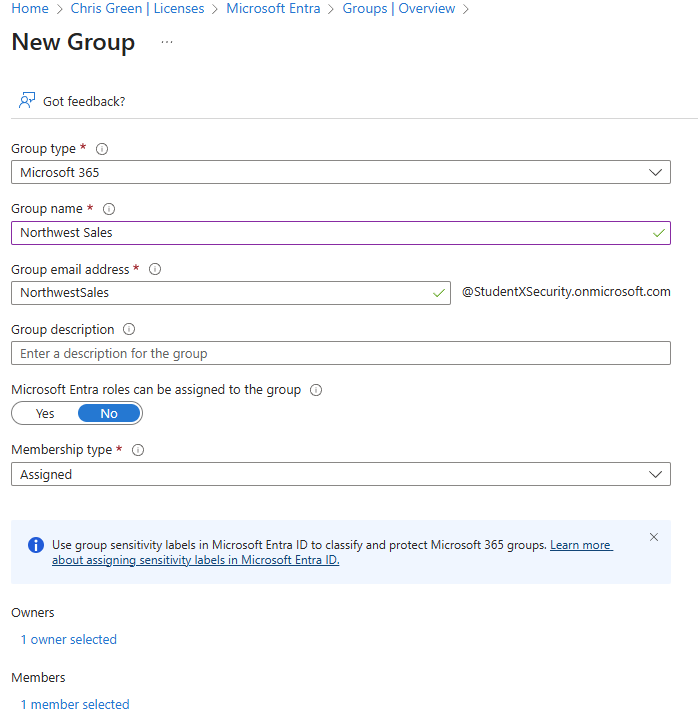
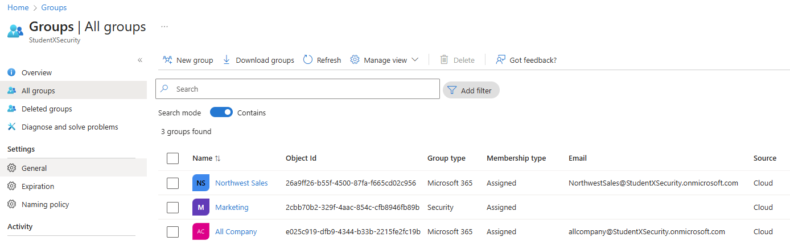

**Lab Title:** Microsoft Entra ID – Create, Configure, and Manage Groups  
**Author:** Chris (Xavier) Charles — StudentXSec Labs  
**Date Executed:** 2025-10-13  
**Lab Environment:** StudentXSecurity.onmicrosoft.com (Business Tenant)  
**IAM Role Used:** Global Administrator (Admin@StudentXSecurity.onmicrosoft.com)  
**Framework Alignment:** NIST 800-53 AC-2 (Account Management), AC-3 (Access Enforcement)  
**Tools & Platforms:** Microsoft Entra ID (Azure AD)  
**Lab Type:** IAM / Access Governance  
**Version:** v1.0  
---

## 📑 Table of Contents
- [🎯 Objective](#-objective)
- [🧰 Tools & Environment](#-tools--environment)
- [🧠 Key Skills Practiced](#-key-skills-practiced)
- [🪜 Steps Performed](#-steps-performed)
- [📑 Results Summary](#-results-summary)
- [💡 Key Takeaways](#-key-takeaways)
- [🧩 Evidence Files](#-evidence-files)
- [📚 Framework Reference](#-framework-reference)
- [🧾 Change History](#-change-history)

---

## 🎯 Objective
Create and configure a **Microsoft 365 group** in Microsoft Entra ID to represent the **Northwest Sales** team.  
This lab demonstrates how to manually create collaboration-enabled groups, assign ownership and membership, and verify their presence within the Entra environment.

---

## 🧰 Tools & Environment
- Microsoft Entra Admin Center → [https://entra.microsoft.com](https://entra.microsoft.com)  
- Tenant: `StudentXSecurity.onmicrosoft.com`  
- Role: Global Administrator  
- License: Microsoft Entra ID P1 + Microsoft 365 Business Basic (Trial)

---

## 🧠 Key Skills Practiced
- Creating **Microsoft 365 Groups** for collaboration  
- Assigning **group ownership** and **membership**  
- Understanding group propagation delays and verification methods  
- Reinforcing access governance through proper group setup

---

## 🪜 Steps Performed

### Step 1 – Create the Microsoft 365 Group “Northwest Sales”
1. Navigate to **Microsoft Entra Admin Center → Identity → Groups → All Groups → + New Group**.  
2. Enter the following details:  
   - **Group type:** Microsoft 365  
   - **Group name:** Northwest Sales  
   - **Membership type:** Assigned  
   - **Owner:** Admin@StudentXSecurity.onmicrosoft.com  
   - **Member:** Chris Green  
3. Review the configuration before creating the group.  

**Screenshot – Group Creation Form:**  

4. Click **Create** and wait for confirmation.  
5. Refresh the **All Groups** list several times until the new group appears.  

**Screenshot – All Groups View:**  

---

## 📑 Results Summary
| Task | Action | Verified |
|------|---------|-----------|
| Create Microsoft 365 Group | Northwest Sales created successfully | ✅ |
| Assign Owner | Admin@StudentXSecurity.onmicrosoft.com assigned | ✅ |
| Assign Member | Chris Green assigned | ✅ |
| Verify Group | Appears in All Groups list | ✅ |

---

## 💡 Key Takeaways
- Confirmed how to create **Microsoft 365 collaboration groups** for departmental access.  
- Learned to assign ownership and membership during group creation.  
- Verified how new groups may take several refresh cycles to appear in Entra ID.  
- Reinforced documentation and evidence tracking standards.

---

## 🧩 Evidence Files
All visual proof captured as embedded screenshots within this README.

| Type | File | Description |
|------|------|-------------|
| Screenshot | `group_northwest_creation_form.png` | Form showing Northwest Sales group setup |
| Screenshot | `group_northwest_list.png` | All Groups view verifying creation |

---

## 📚 Framework Reference
- **NIST 800-53:** AC-2 (Account Management), AC-3 (Access Enforcement)  
- **ISO/IEC 27001:** A.9 (Access Control)

---

## 🧾 Change History
| Version | Date | Changes |
|----------|------|----------|
| v1.0 | 2025-10-13 | Initial documentation for Northwest Sales group creation |

