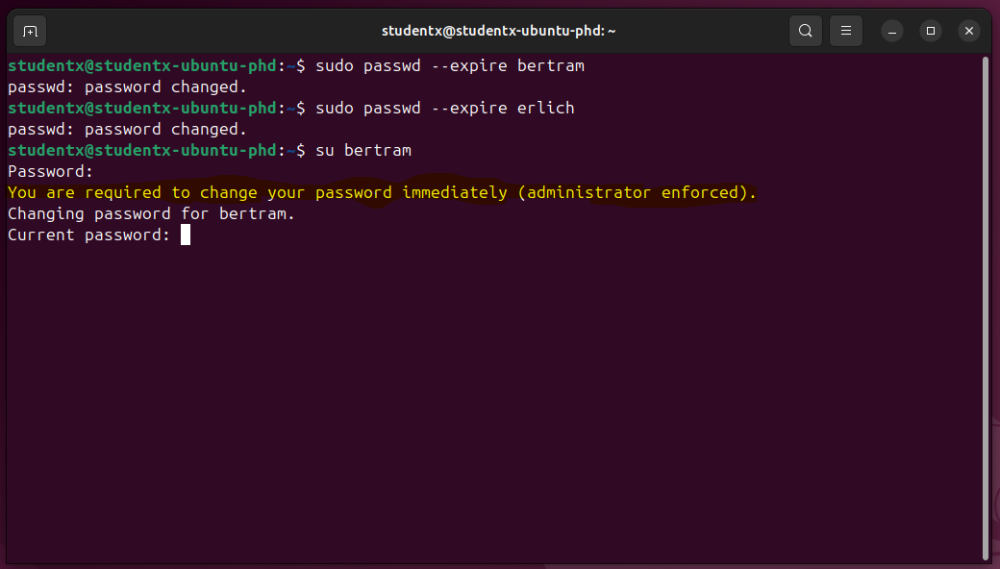

# QuickLab: Add Users to Linux Host

**Source:** TCM Security Practical Help Desk Course  
**Ticket ID:** #4561290  
**Date Completed:** 2025-09-10
**Last Updated:** 2025-09-10 
**Difficulty:** Beginner Linux Administration  
**Tools Used:** Ubuntu (VirtualBox), Terminal  

---

## 🧠 Objective
Simulate a helpdesk ticket by:
- Adding two new users (`bertram`, `erlich`)  
- Forcing password reset at first login  
- Creating a secure `/Confidential` directory with least-privilege access  

---

## ⚙️ Steps Taken

### Step 1: User Creation
Created the first user `bertram` with `adduser`.  

*Repeated for `erlich` using the same steps.*  

---

### Step 2: Enforce Password Reset
Forced both accounts to expire their initial password at first login.  
 

Verification prompt when attempting login as `bertram`:  

---

### Step 3: Create and Secure Confidential Folder
Created a folder `/Confidential` in the root directory, restricted access, and set correct group ownership.  

---

### Step 4: Group Membership Verification
Confirmed only `bertram` and `erlich` are in the `confidential` group with access to the folder.  

---

## ✅ Takeaways
- Practiced **Linux user management** and password policies.  
- Enforced **security hygiene** by requiring password changes on first login.  
- Applied **principle of least privilege** to directory access.  
- Simulated a real-world IT helpdesk workflow in a professional way.  

