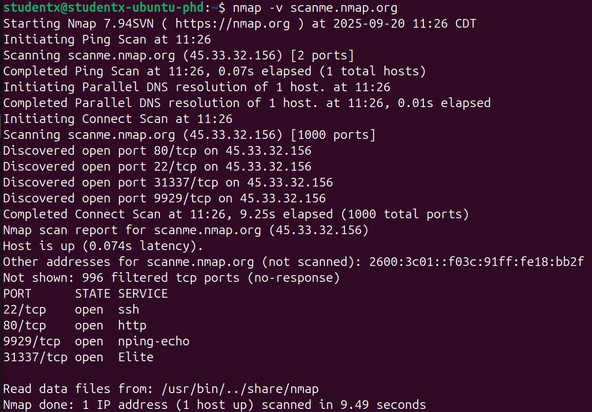
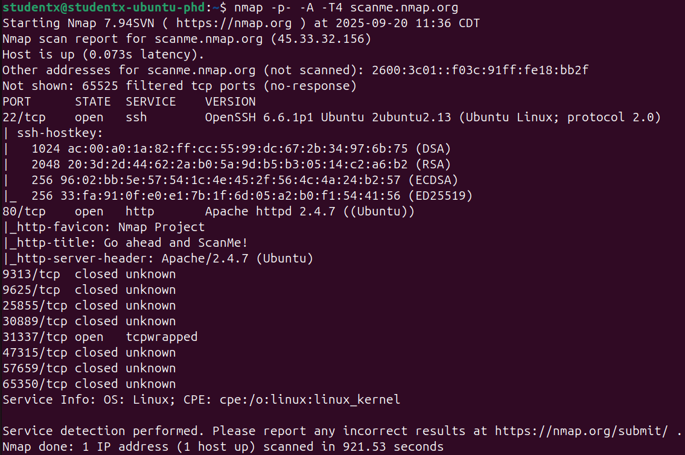
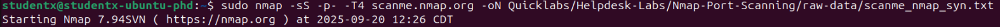
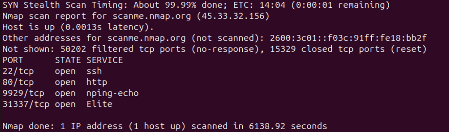
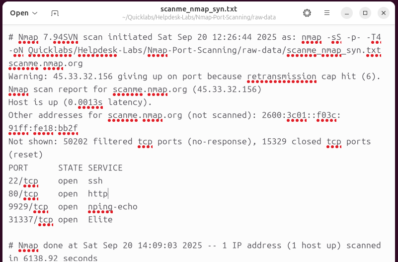

# QuickLab: Nmap Port Scanning (Helpdesk)

**Source:** TCM Helpdesk optional lab  
**Date Completed:** 2025-09-20  
**Difficulty:** Beginner — Recon / Sysadmin fundamentals  
**Tools Used:** `nmap` (Ubuntu VM)

---

## 🎯 Objective
Perform authorized reconnaissance using `nmap` against a sanctioned test host (`scanme.nmap.org`), capture raw outputs and screenshots, and document results as part of a Vulnerability Management workflow.

---

## 🛠 Environment
- Target (authorized): `scanme.nmap.org`  
- VM: Ubuntu (VirtualBox on Windows host)  
- Repo paths used in this lab:
  - `raw-data/` — raw `.nmap/.txt/.xml/.gnmap` outputs  
  - `screenshots/` — terminal screenshots

---

## 🔢 Commands I ran
1. Install nmap:
`bash
sudo apt update
sudo apt install -y nmap`

2. Quick/basic sanity scan:
`bash
nmap -v scanme.nmap.org`

3. Aggressive all-ports archival scan:
`bash
nmap --stats-every 10s -p- -A -T4 scanme.nmap.org -oA raw-data/scanme_nmap_A-full`
(Raw outputs: pending file)

4. Stealth SYN scan (saved output used in this writeup):
`bash
sudo nmap -sS -p- -T4 scanme.nmap.org -oN raw-data/scanme_nmap_syn.txt`

---

## 🔎 Results (stealth scan)
- Nmap scan report for scanme.nmap.org (45.33.32.156)
- Host is up (0.0013s latency).
- Other addresses for scanme.nmap.org (not scanned): 2600:3c01::f03c:91ff:fe18:bb2f
- Not shown: 50202 filtered tcp ports (no-response), 15329 closed tcp ports (reset)

PORT      STATE SERVICE
- 22/tcp    open  ssh
- 80/tcp    open  http
- 9929/tcp  open  nping-echo
- 31337/tcp open  Elite

Nmap done: 1 IP address (1 host up) scanned in 6138.92 seconds

---

## Summary (recruiter-friendly):

Open ports discovered: 22 (SSH), 80 (HTTP), 9929 (nping-echo), 31337 (Elite).

Host latency: 0.0013s (host is reachable).

Scan duration: 6138.92 seconds (≈102 minutes) for the full SYN scan (see note below).

Notes: Most ports are filtered or closed (see raw output); the above four services responded.

---

## ✅ Analysis & Recommendations

### Immediate triage

SSH (22): identify server/version (from the .nmap/.xml raw output), check for outdated OpenSSH CVEs. Harden: disable root login, prefer key-based auth, limit ciphers, rate-limit connections.

HTTP (80): run focused web checks (PortSwigger labs / Burp / Nikto) for common issues (XSS, directory indexing, misconfig). Enforce TLS redirection and security headers if applicable.

Service checks (9929 / 31337): verify whether these are expected. If unexpected, escalate for incident analysis — unusual services can be indicators of demo/test services or deliberate honeypots.

Vuln Mgmt steps: create a ticket per host/service, map versions → CVEs → priority (CVSS + business impact), plan remediation (patch/configure/monitor), then verify.

---

## 🧭 Mapping to frameworks (short)

CompTIA Security+ (SY0-701): Reconnaissance and scanning map to Threats and Vulnerabilities and Tools & Technologies.

OWASP: HTTP checks align with OWASP Top 10 (A1–A10) — run web checks after discovering port 80.

MITRE ATT&CK: Discovery & Network Scanning map to techniques like T1046 – Network Service Discovery and T1595 – Active Scanning.

---

## 🔗 Files & Evidence (in this folder)

- raw-data/scanme_nmap_syn.txt — stealth SYN scan (this writeup) 

- raw-data/scanme_nmap_A-full.nmap, .xml, .gnmap — aggressive scan outputs (pending)

- Screenshots:

  - screenshots/nmap-basic-scan.png

  - screenshots/nmap-aggressive-output.png

  - screenshots/nmap-stealth-final.png

  - screenshots/nmap-stealth-final2.png

  - screenshots/nmap-stealth-final3.png (raw file pending)
    
---

## ✍️ Key takeaways

This QuickLab documents ethical reconnaissance using nmap on an authorized test host. Saving raw outputs and screenshots produces reproducible evidence and demonstrates an end-to-end reconnaissance step in a Vulnerability Management workflow (Recon → Scan → Analyze → Remediate).
